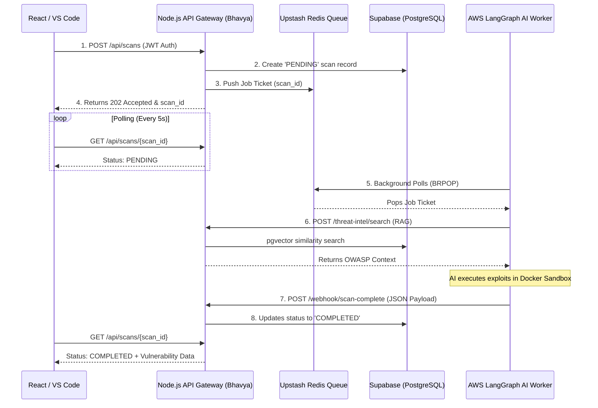

# 🚀 AURIX Backend & Infrastructure: Interview Master Guide

This document is your ultimate cheat sheet for your backend interview. It contains the exact architectural flow you built, a visual diagram to help you explain it, and the toughest senior-level interview questions (with answers) to help you defend your technical decisions.

---

## 🏗️ 1. The System Architecture & Flow

AURIX is built on a **Decoupled Microservice Architecture**. Data moves seamlessly across three distinct environments: Client Interfaces, your Node.js API Gateway, and an isolated AWS AI Worker.

### 📊 Visual Flow Diagram
*(If they ask you to draw the system on a whiteboard, draw this!)*

### 📝 Step-by-Step Execution Loop (To explain out loud)
1. **Ingestion & Queuing**: The user uploads code or a GitHub URL. My Node.js API authenticates the request, creates a `PENDING` record in PostgreSQL, and drops a Job Ticket into an Upstash Redis Queue. This instantly frees up the API to respond to the client, ensuring the server doesn't freeze.
2. **AI Processing**: An isolated AWS worker runs a Python daemon that pulls the job from Redis. Before scanning, it hits my API's `/threat-intel/search` endpoint to fetch context from my `pgvector` RAG database.
3. **Webhook Resolution**: Once the AI finishes scanning and verifying bugs via a Docker sandbox, it compiles a huge JSON payload and POSTs it back to my secure internal Webhook endpoint. 
4. **Client Polling**: While all this happens, the client UI is polling my API every 5 seconds. Once the webhook saves the final payload to PostgreSQL, the API returns the `COMPLETED` data to the client.

---

## 🧠 2. Senior-Level Interview Q&A

### Q1. "Why did you use a Redis queue instead of sending an HTTP request directly to the AI worker?"
**Answer:** "Because AI scanning is a heavily synchronous, long-running task (taking 2-3 minutes). If my Express API waited for an HTTP response, the connection would time out and block the Node.js event loop. Dropping a 'Job Ticket' into Redis allows the backend to immediately return a `202 Accepted` response. The AI worker processes jobs at its own pace and returns data asynchronously via a Webhook. This decoupling ensures the API never crashes under heavy load."

### Q2. "How did you implement the RAG (Retrieval-Augmented Generation) system for your AI?"
**Answer:** "I built the RAG infrastructure natively within our PostgreSQL database using the `pgvector` extension. I used HuggingFace's `Transformers.js` inside my Node.js backend to convert OWASP threat intelligence documents into 384-dimensional vector embeddings and stored them in the DB. When the AI worker hits my `/threat-intel/search` endpoint, I execute a PostgreSQL RPC (Remote Procedure Call) that uses cosine similarity to rapidly return the most mathematically relevant security guidelines."

### Q3. "Why did you use a Webhook for the AI worker to send data back, rather than giving the AI worker direct database access?"
**Answer:** "Security and Separation of Concerns. Giving external worker nodes direct database credentials is a huge security risk, especially since our AI worker executes untrusted, malicious code in its sandboxes. By forcing the AI worker to POST its results to my Webhook, my API acts as a firewall. It validates the incoming JSON payload and handles the actual database insertions securely."

### Q4. "How do you handle security and prevent users from accessing each other's vulnerability reports?"
**Answer:** "I implemented two layers of security. First, the API is protected by a JWT-based authentication middleware. Second, at the database layer, I utilized PostgreSQL's Row-Level Security (RLS) policies. The database physically rejects any query where the `user_id` on the row doesn't match the `auth.uid()` extracted from their JWT token. Data isolation is enforced at the absolute lowest level."

### Q5. "How did you handle large `.zip` file uploads without crashing your Node.js server?"
**Answer:** "Handling large files entirely in memory will crash a Node server. I used `multer` to intercept the `multipart/form-data` and streamed the payload directly into Supabase Object Storage rather than storing it locally. To prevent storage bloat, I also implemented a `node-cron` job that runs hourly to permanently delete zip files once a scan is marked as COMPLETED."

### Q6. "How did you protect your API from being spammed or DDoS'd?"
**Answer:** "I implemented `express-rate-limit` on the API Gateway. To ensure the rate limit works consistently across multiple server instances in production, I backed the rate limiter with Upstash Redis (`rate-limit-redis`). This tracks user IPs globally in memory, strictly blocking them if they exceed our allowed limit."

### Q7. "Since the AI process takes a few minutes, how does the frontend know when the scan is finished?"
**Answer:** "Because HTTP is stateless, I built a polling endpoint (`GET /api/scans/:scan_id`). The frontend uses a `setInterval` loop to hit that endpoint every 5 seconds. As soon as my webhook receives the data from the AI, it updates the database status from `PENDING` to `COMPLETED`. The next time the frontend polls, it sees the status change and downloads the report."

### Q8. "How did you design your database relationships? What happens if a user deletes their account?"
**Answer:** "I designed a highly relational PostgreSQL schema. A `USER` has many `PROJECTS`, a `PROJECT` has many `SCANS`, and a `SCAN` has many `VERIFIED_VULNERABILITIES`. To keep the database clean, I utilized strict Foreign Keys with `ON DELETE CASCADE` constraints. If a user deletes their account, the database automatically ripples down and deletes every associated record instantly."

### Q9. "What happens if the AI worker crashes midway through a scan? Does the user just wait forever?"
**Answer:** "Currently, the AI worker is designed to catch its own errors and send a `FAILED` payload to the webhook. However, if the AWS server completely loses power, the scan remains `PENDING` in the database. To make the system fully fault-tolerant, my next architectural step is to add a background Cron job that sweeps the database for any scans `PENDING` for over 15 minutes and automatically marks them as `FAILED`."

### Q10. "How did you manage environment variables and sensitive credentials?"
**Answer:** "Security is paramount. I never hardcoded any database passwords, Redis URIs, or Webhook security tokens in the source code. I used the `dotenv` package for local development and ensured `.env` was in our `.gitignore`. When deploying to production on Render, I injected these secrets directly into the server's environment variables."
