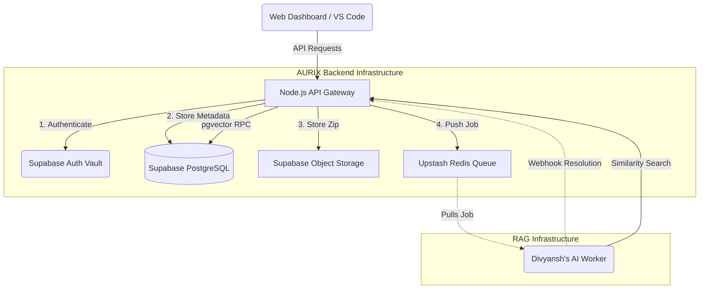

#  AURIX Backend System Architecture

Welcome to the **AURIX Backend Ecosystem**! This document is designed to help the Frontend (Bhumika), VS Code Extension (Divyanshi), and Core AI Engine (Divyansh) teams understand exactly how the backend layer operates, how data flows, and how to interact with the API endpoints.

---

##  1. High-Level Architecture Overview

The backend acts as the central API Gateway and traffic controller for the entire AURIX platform. It is built on **Node.js + Express.js** and relies on two major cloud infrastructures:
1. **Supabase (PostgreSQL + Auth + Storage + Vector)**: Acts as the primary database, identity provider, large file vault, and vector search engine.
2. **Upstash Redis**: Acts as a high-speed message queue and rate-limiter, buffering requests so the system never crashes under heavy load.

### Structural Flow Diagram

---

##  2. Core Service Workflows

### Flow A: GitHub URL Ingestion
When a user pastes a GitHub URL in the dashboard:
1. The Frontend sends a `POST /api/scans/github` request with a Supabase JWT.
2. The Backend validates the JWT via the Auth Vault.
3. The Backend creates a `PENDING` scan record in PostgreSQL.
4. The Backend pushes a job payload to the **Redis Queue** for the AI Worker to pick up.

### Flow B: Zip File Upload Ingestion
When a user clicks "Zip & Ship" in VS Code:
1. The VS Code extension sends a `POST /api/scans/upload` request as `multipart/form-data`.
2. The Backend validates the JWT and temporarily buffers the file in memory.
3. The file is streamed directly to **Supabase Storage** (`scan-payloads` bucket).
4. The Backend logs the scan as `PENDING` in the DB and pushes the storage path to the **Redis Queue**.

### Flow C: AI Webhook Resolution
When Divyansh's AI Worker finishes scanning the code:
1. It hits the **Internal Webhook** (`POST /api/internal/webhook/scan-complete`) using a secure `aurix-dev-token`.
2. The backend intercepts this, updates the scan status to `COMPLETED`, and writes the detailed vulnerabilities into the `verified_vulnerabilities` table.

### Flow D: RAG Threat Intel Search
When the AI Worker needs context about a vulnerability (e.g., OWASP guidelines):
1. It converts a query to a 384-dimensional vector embedding.
2. It hits `POST /api/internal/threat-intel/search`.
3. The backend executes a specialized RPC function (`match_threat_intel`) against the Supabase `pgvector` extension to rapidly find the most mathematically similar documentation.

---

##  3. API Endpoints Map

### Public/Client Endpoints (Requires Supabase JWT)
These are for **Bhumika** (Frontend) and **Divyanshi** (VS Code).

| Method | Endpoint | Description | Auth Header |
|---|---|---|---|
| `GET` | `/health` | Check if the API is alive | *None* |
| `POST` | `/api/scans/github` | Queue a GitHub repo for scanning | `Bearer <JWT>` |
| `POST` | `/api/scans/upload` | Upload a `.zip` file for scanning | `Bearer <JWT>` |
| `GET` | `/api/scans/:scan_id` | Check scan status and fetch vulnerabilities | `Bearer <JWT>` |

### Internal Endpoints (Requires Dev Token)
These are exclusively for **Divyansh** (AI Worker).

| Method | Endpoint | Description | Auth Header |
|---|---|---|---|
| `POST` | `/api/internal/webhook/scan-complete` | Save finished AI scan results to the DB | `Bearer aurix-dev-token` |
| `POST` | `/api/internal/threat-intel/search` | Perform RAG vector similarity search | *None* |

---

##  4. Security & Maintenance Services

* **Rate Limiter:** We use `express-rate-limit` backed by Redis to strictly limit users (e.g., 10 scans per hour) to prevent DDoS attacks and budget drain.
* **Automated Data Sanitizer:** A `node-cron` job automatically runs inside the backend every hour. It scans the database for `COMPLETED` or `FAILED` scans and permanently deletes their `.zip` files from Supabase Storage to enforce strict privacy compliance.

---

